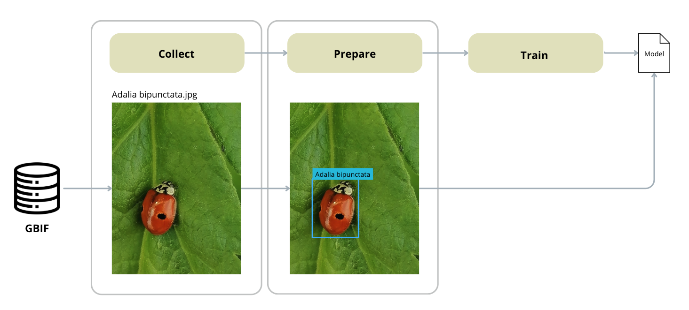

# B++ repository

[](https://zenodo.org/badge/latestdoi/765250194) 
[](https://pypi.org/project/bplusplus/)
[](https://pypi.org/project/bplusplus/)
[](https://pypi.org/project/bplusplus/)
[](https://pepy.tech/project/bplusplus)
[](https://pepy.tech/project/bplusplus)
[](https://pepy.tech/project/bplusplus)

This repo can be used to quickly generate YOLOv8 models for biodiversity monitoring, relying on Ultralytics and a GBIF dataset.

All code is tested on macOS and Python 3.12, without GPU. GPU would obviously accelerate the below steps, Ultralytics should automatically select the available GPU if there is any.

# How does it work?

To use the bplusplus package to train your own insect detection model, we provide four functions: `collect()`, `prepare()`, `train()`, `validate()`. When training an object detection model, you need a dataset with labeled data of insect species. For this package in the `collect()` function, we use images from the GBIF database (https://doi.org/10.15468/dl.dk9czq) and run them through a pretrained *insect detection model*, defining the bounding boxes for the insects, and add the scientific name from the file path. In that way, we are able to prepare a full dataset of labeled and classified insect data for training. 



### Install package

```python
pip install bplusplus
```

### bplusplus.collect()

This function takes three arguments: 
- **search_parameters: dict[str, Any]** - List of scientific names of the species you want to collect from the GBIF database 
- **images_per_group: int** - Number of images per species collected for training
- **output_directory: str** - Directory to store collected images

Example run: 
```python
species_list=[ "Vanessa atalanta", "Gonepteryx rhamni", "Bombus hortorum"] 
images_per_group=20 
output_directory="/dataset/selected-species"

# Collect data from GBIF
bplusplus.collect(
  search_parameters=species_list,
  images_per_group=images_per_group,
  output_directory=output_directory
)
```

### bplusplus.prepare()

Prepares the dataset for training by performing the following steps:
  1. Copies images from the input directory to a temporary directory.
  2. Deletes corrupted images.
  3. Downloads YOLOv5 weights for *insect detection* if not already present.
  4. Runs YOLOv5 inference to generate labels for the images.
  5. Deletes orphaned images and inferences.
  6. Updates labels based on class mapping.
  7. Splits the data into train, test, and validation sets.
  8. Counts the total number of images across all splits.
  9. Makes a YAML configuration file for YOLOv8.

This function takes three arguments: 
- **input_directory: str** - The path to the input directory containing the images.
- **output_directory: str** - The path to the output directory where the prepared dataset will be saved.
- **with_background: bool = False** - Set to False if you don't want to include/download background images

```python
# Prepare data 
bplusplus.prepare(
    input_directory='/dataset/selected-species',
    output_directory='/dataset/prepared-data',
    with_background=False 
)
```

### bplusplus.train()

This function takes five arguments: 
- **input_yaml: str** - yaml file created to train the model
- **output_directory: str**
- **epochs: int = 30** - Number of epochs to train the model
- **imgsz: int = 640** - Image size 
- **batch: int = 16** - Batch size for training

```python
# Train model
model = bplusplus.train(
  input_yaml="/dataset/prepared-data/dataset.yaml", # Make sure to add the correct path
  output_directory="trained-model",
  epochs=30, 
  batch=16 
)
```

### bplusplus.validate()

This function takes two arguments: 
- **model** - The trained YOLO model
- **Path to yaml file** 

```python
metrics = bplusplus.validate(model, '/dataset/prepared-data/dataset.yaml')
print(metrics)
```


## Full example
```python
import bplusplus

species_list=[ "Vanessa atalanta", "Gonepteryx rhamni", "Bombus hortorum"] 
images_per_group=20 
output_directory="/dataset/selected-species"

# Collect data from GBIF
bplusplus.collect(
  search_parameters=species_list,
  images_per_group=images_per_group,
  output_directory=output_directory
)

# Prepare data 
bplusplus.prepare(
    input_directory='/dataset/selected-species',
    output_directory='/dataset/prepared-data',
    with_background=False 
)

# Train model
model = bplusplus.train(
  input_yaml="/dataset/prepared-data/dataset.yaml", # Make sure to add the correct path
  output_directory="trained-model",
  epochs=30, 
  batch=16 
)

# Validate model
metrics = bplusplus.validate(model, '/dataset/prepared-data/dataset.yaml')
print(metrics)

```

You have created a YOLOv8 model for insect detection. 

# Earlier releases

There is also a pretrained YOLOv8 classification model, containing 2584 species, from an earlier release and paper. 
The CV model as presented in the paper can be downloaded from: https://drive.google.com/file/d/1wxAIdSzx5nhTOk4izc0RIycoecSdug_Q/view?usp=sharing

To run/use the model, please consult the Ultralytics documentation. 


# Citation

All information in this GitHub is available under MIT license, as long as credit is given to the authors.

**Venverloo, T., Duarte, F., B++: Towards Real-Time Monitoring of Insect Species. MIT Senseable City Laboratory, AMS Institute.**
